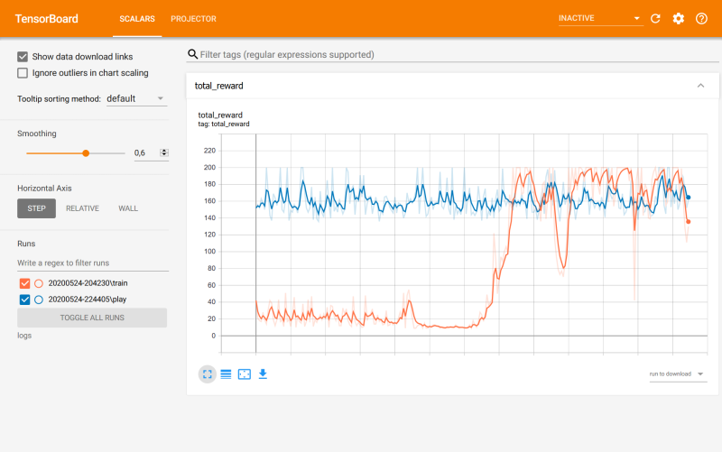

# Dueling Deep Q-Network Agent

Dueling deep Q-network (DQN) agent for training/playing _Classical control_ environments of [OpenAI Gym](https://gym.openai.com/). The agent can be adapted to interact with similar environments, i.e. with discrete action space etc., by changing a few lines of code.

## Getting Started

### Source code
Source code of the DQN agent: [dqn_agent_cartpole.py](dqn_agent_cartpole.py)

### Used Python packages

The following packages have been used during development and testing:

```
python 3.7.7
tensorflow 2.2.0
numpy 1.18.1
matplotlib 3.1.3
gym 0.16.0
```

### Deep Q-Network architecture
The following neural network architecture is used:
1. Deep Q-Learning with active and target network [1][2]
2. Dueling architecture [3]

#### References
[1] Volodymyr Mnih, et al. Playing atari with deep reinforcement learning. arXiv preprint arXiv:1312.5602 (2013). \
[2] Volodymyr Mnih, et al. Human-level control through deep reinforcement learning. Nature 518, 529-533 (2015).\
[3] Ziyu Wang, et al. Dueling network architectures for deep reinforcement learning. arXiv preprint arXiv:1511.06581 (2015).

## How to use
First create a _Classical control_ environment of [OpenAI Gym](https://gym.openai):
```python
# For example: CartPole environment
env = gym.make('CartPole-v0')
```
Afterwards train the DQN agent and run/play the environment after training: \
__Note:__ The agent automatically saves the network weights when the training is finished (folder: _logs/current_date/trained_network_).
```python
# Initialize DQN agent
agent = DQNAgent(env)
# Train
agent.train()
# Play/run the environment using the trained agent
agent.play()
```
Don't forget to close the environment.
```python
env.close()
```
It is also possible to load saved network weights:
```python
env = gym.make('CartPole-v0')
agent = DQNAgent(env)
# Load saved weights
agent.load_network('logs/20200523-221335/trained_network')
# Optional: train network further after loading weights
# agent.train()
# Play/run the environment using the (pre-)trained agent
agent.play()
env.close()
```

#### Docstrings
For a detailed description of the methods of the DQN agent see docstrings.

Example:
```python
# Public method of the DQN agent
def train(self, replay_size=1000, max_episodes=300, max_steps=300, batch_size=48, 
        sync_steps=50, epsilon_start=1.0, epsilon_final=0.01, epsilon_decay=0.995, 
        gamma=0.9):
        """Trains the DQN agent by interacting with the environment.

        Args:
            replay_size (int, optional): Size of the experience/replay buffer. 
                Defaults to 1000.
            max_episodes (int, optional): Maximum number of episodes. 
                Defaults to 200.
            max_steps (int, optional): Maximum number of actions/steps per episode. 
                Defaults to 300.
            batch_size (int, optional): Batch size sampled from the replay buffer. 
                Defaults to 48.
            sync_steps (int, optional): After how many actions/steps the active and 
                target network will be synchronized. Defaults to 50.
            epsilon_start (float, optional): Initial value of epsilon. Defaults to 1.0.
            epsilon_final (float, optional): Final value of epsilon. Defaults to 0.01.
            epsilon_decay (float, optional): Decay rate of epsilon. Defaults to 0.995.
            gamma (float, optional): Discount factor. Defaults to 0.9.
        """
```

## Performance - CartPole
A typical training/play performance for the CartPole environment is stored in the _logs_ folder (TensorBoard log file). The weights of the trained network are also saved in the same directory. 

- __Screenshot of the TensorBoard visualization (orange: training, blue: playing). Note that the training performance may vary depending on the initial network weights.__



- __Screenshot of the CartPole environment.__


## Authors

* **Taner Esat** - [esat.xyz](http://esat.xyz) & [noisyn.de](http://noisyn.de/)

## License

This project is licensed under the MIT License - see the [LICENSE.md](LICENSE.md) file for details.